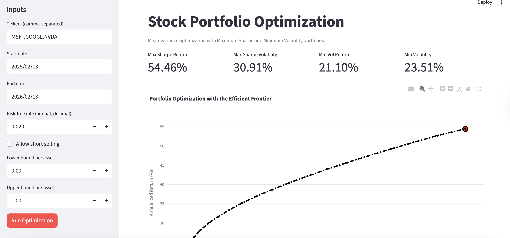

# Portfolio Management - Stock Portfolio Optimization


Production-ready Python project for portfolio optimization using historical stock prices, mean-variance analytics, and a Streamlit user interface.

## Table of Contents

1. Project Overview
2. Features
3. Architecture
4. Project Structure
5. Quickstart
6. Configuration
7. Optimization Method
8. Output
9. App Sample Output
10. Limitations
11. Roadmap

## Project Overview

This project builds optimized equity portfolios from historical price data sourced via `pandas-datareader` (Stooq).  
It computes:

- Maximum Sharpe Ratio portfolio
- Minimum Volatility portfolio
- Efficient Frontier curve

The interface is delivered through Streamlit for interactive use.

## Features

- Historical close-price retrieval from Stooq
- Return and covariance estimation from daily returns
- Constrained optimization using `scipy.optimize.minimize` with SLSQP
- Efficient frontier visualization with Plotly
- Interactive Streamlit controls for:
  - Tickers
  - Date range
  - Risk-free rate
  - Weight bounds (including optional short-selling)
- CSV export of optimized allocations

## Architecture

- Data Layer: `get_data(...)` fetches and prepares close-price returns
- Optimization Layer:
  - `max_sharpe_ratio(...)`
  - `min_portfolio_var(...)`
  - `efficient_frontier(...)`
- Presentation Layer:
  - `ef_graph(...)` builds Plotly chart
  - `app.py` provides Streamlit UX

## Project Structure

```text
Portfolio_Management/
├── app.py
├── requirements.txt
├── README.md
└── Source_Code/
    └── Load_Data.py
```

## Quickstart

1. Create and activate a virtual environment.

```bash
python -m venv .venv
source .venv/bin/activate
```

2. Install dependencies.

```bash
pip install -r requirements.txt
```

3. Run the Streamlit app.

```bash
streamlit run app.py
```

4. Open the local URL shown in terminal (usually `http://localhost:8501`).

## Configuration

You can control:

- Tickers (comma-separated)
- Start and end date
- Annual risk-free rate (decimal, e.g. `0.02`)
- Weight bounds (`lower_bound`, `upper_bound`)
- Short-selling behavior by setting lower bound below `0`

## Optimization Method

The implementation follows Modern Portfolio Theory under constraints.

1. Return model  
   Daily simple returns from close prices:
   `r_t = (P_t - P_{t-1}) / P_{t-1}`

Estimated inputs:

- `mu = E[r]` (mean return vector)
- `Sigma = Cov(r)` (covariance matrix)

Annualization factor: `252` trading days.

2. Portfolio metrics  
   For weight vector `w`:

- `R_p = 252 * (mu^T * w)` (annualized return)
- `sigma_p = sqrt(252 * (w^T * Sigma * w))` (annualized volatility)

3. Maximum Sharpe Ratio  
   Objective:
   `maximize (R_p - r_f) / sigma_p`

Implemented as minimization:

- Objective function: `negative_sharpe(...)`
- Solver: `SLSQP`

4. Minimum Volatility  
   Objective:
   `minimize sigma_p`

5. Efficient Frontier  
   For each target return `R*`, solve:
   `minimize sigma_p`  
   subject to:

- `R_p = R*`
- `sum(w_i) = 1`

6. Constraints used in all optimizations

- Budget constraint: `sum(w_i) = 1`
- Bound constraints: `l_i <= w_i <= u_i`

`SLSQP` is used because it supports both equality constraints and bound constraints.

## Output

The app provides:

- Efficient frontier chart
- Max Sharpe and Min Vol KPIs
- Asset allocations for both optimized portfolios
- Downloadable CSV of allocation weights

## App Sample Output

The screenshot below shows a real app run with optimization metrics, allocation tables, and efficient frontier output.



## Limitations

- Historical data does not guarantee future performance.
- Mean/covariance estimates are sample-sensitive.
- Transaction costs, slippage, and taxes are not modeled.
- Single-period optimization only (no rebalancing schedule).

## Incoming Features

- Add backtesting and periodic rebalancing
- Add robust covariance estimators (Ledoit-Wolf, EWMA)
- Add risk constraints (max drawdown proxy, sector caps)
- Add benchmark comparison (S&P 500, equal-weight portfolio)
